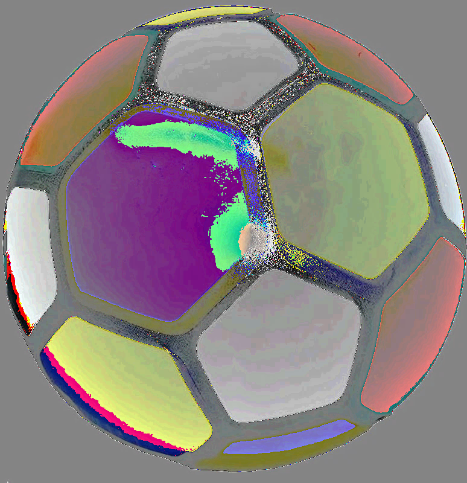

# SCT_CS_2 — Image Encryption & Decryption Tool ⚽🔐
A Python implementation of pixel-level image encryption using XOR operations and channel manipulation, developed as **Task 2** of the Cyber Security Internship at **SkillCraft Technology**. The tool provides reversible encryption and decryption of images using mathematical operations.

---

## Overview
This project demonstrates image encryption and decryption through pixel manipulation techniques. By applying XOR operations, modular arithmetic, or channel swapping to image pixels, the original picture becomes completely scrambled (encrypted). The same operations can then perfectly restore the original image (decryption), showcasing the reversible nature of these cryptographic methods.

---

## Getting Started

### Prerequisites
- Python 3.x installed on your system
- Pillow (PIL) library

### Installation
```bash
pip install Pillow
```

### Running the Application
```bash
python image_encryption.py --input <input_file> --output <output_file> --mode <encrypt/decrypt> --op <operation> [options]
```

The program requires the following arguments:
1. **--input** (`-i`) — path to the input image file
2. **--output** (`-o`) — path where the output image will be saved
3. **--mode** (`-m`) — choose `encrypt` or `decrypt`
4. **--op** — operation type: `xor`, `add`, `sub`, or `swap`
5. **--key** (`-k`) — numeric key value (0-255) for math operations
6. **--swap** (`-s`) — channel swap type (`rg`, `rb`, `gb`) for swap operation

### Sample Run

**Encryption:**
```bash
python image_encryption.py --input actual.jpg --output encrypted.png --mode encrypt --op xor --key 123
```
**Output:**
```
✓ Successfully wrote encrypted.png
```

**Decryption:**
```bash
python image_encryption.py --input encrypted.png --output decrypted.png --mode decrypt --op xor --key 123
```
**Output:**
```
✓ Successfully wrote decrypted.png
```

---

## Features

| Feature | Description |
|---|---|
| **XOR Encryption** | Self-reversing cipher that applies XOR operation to each RGB channel |
| **Addition Cipher** | Adds key value to pixels using modular arithmetic (mod 256) |
| **Subtraction Cipher** | Subtracts key value from pixels with automatic wraparound |
| **Channel Swapping** | Swaps RGB color channels (Red↔Green, Red↔Blue, Green↔Blue) |
| **Format Support** | Works with PNG, JPG, and JPEG formats |
| **Alpha Preservation** | Maintains transparency channel without encryption |
| **Reversible Operations** | All transformations are fully reversible for perfect restoration |
| **Input Validation** | Built-in checks for file existence and valid key ranges (0-255) |

---

## How It Works

The core class `ImageCipher` processes images pixel-by-pixel and applies the following transformations:

### XOR Operation (Recommended)
- **Encryption**: `New_Pixel = Original_Pixel ⊕ Key`
- **Decryption**: `Original_Pixel = New_Pixel ⊕ Key`
- XOR is self-reversing, making it ideal for symmetric encryption

### Addition/Subtraction
- **Add Encryption**: `New_Value = (Original_Value + Key) % 256`
- **Add Decryption**: `Original_Value = (New_Value - Key) % 256`
- Uses modular arithmetic to keep values within valid RGB range (0-255)

### Channel Swapping
- Rearranges RGB channels to create color-shifted versions
- Swaps are self-reversing (applying twice restores original)
- Options: RG (Red↔Green), RB (Red↔Blue), GB (Green↔Blue)

The decryption process automatically applies the inverse operation, ensuring pixel-perfect restoration of the original image.

---

## 📸 Project Workflow





**Workflow Process:**
1. **Original Image** (`actual.jpg`) - Clear football image
2. **Encryption** - Apply XOR operation with key 123 to scramble pixels
3. **Encrypted Image** (`encrypted.png`) - Completely unrecognizable output
4. **Decryption** - Apply same XOR operation to reverse encryption
5. **Decrypted Image** (`decrypted.png`) - Perfectly restored original

---

## Operations Supported

### 1. XOR Encryption
```bash
python image_encryption.py -i actual.jpg -o encrypted.png -m encrypt --op xor -k 123
python image_encryption.py -i encrypted.png -o decrypted.png -m decrypt --op xor -k 123
```

### 2. Addition Cipher
```bash
python image_encryption.py -i actual.jpg -o encrypted.png -m encrypt --op add -k 75
python image_encryption.py -i encrypted.png -o decrypted.png -m decrypt --op add -k 75
```

### 3. Subtraction Cipher
```bash
python image_encryption.py -i actual.jpg -o encrypted.png -m encrypt --op sub -k 50
python image_encryption.py -i encrypted.png -o decrypted.png -m decrypt --op sub -k 50
```

### 4. Channel Swapping
```bash
python image_encryption.py -i actual.jpg -o swapped.png -m encrypt --op swap -s rg
python image_encryption.py -i swapped.png -o restored.png -m decrypt --op swap -s rg
```

---

## Project Structure

```
SCT_CS_2/
├── image_encryption.py   # Main encryption/decryption script
├── actual.jpg            # Original football image
├── encrypted.png         # Encrypted output
├── decrypted.png         # Decrypted output (restored original)
└── README.md             # Project documentation
```

---

## Technical Details

### Supported Formats
- **Input**: PNG, JPG, JPEG
- **Output**: PNG (with alpha), JPG (RGB only)

### Image Processing
- Converts all images to RGBA for consistent processing
- Applies transformations to RGB channels only
- Preserves alpha channel without modification
- Handles both 3-channel (RGB) and 4-channel (RGBA) images

### Error Handling
- Validates input file existence
- Checks key values are within valid range (0-255)
- Ensures proper operation selection
- Provides clear error messages for invalid inputs

---

## Developed By
**RITIK KUMAR**   
Cyber Security Intern — Task 2 | [SkillCraft Technology](https://www.skillcrafttechnology.com)
